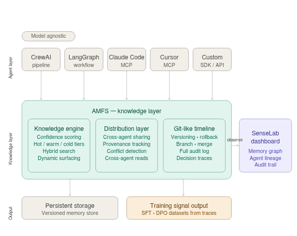

# AMFS — Agent Memory File System

[](https://github.com/raia-live/amfs/actions/workflows/test-python.yml)
[](https://github.com/raia-live/amfs/actions/workflows/test-typescript.yml)
[](LICENSE)

**GitHub for agent memory.** Every agent gets a brain — its own repo of what it knows. Branch it, diff it, open a PR, review the changes, merge. Roll back to any point. The mental model is already in every developer's head.

**[Documentation](https://raia-live.github.io/amfs/)** · **[Roadmap](https://github.com/orgs/raia-live/projects/2)** · **[Contributing](https://raia-live.github.io/amfs/contributing/)**

## The Problem

When agents share memory today, it's chaos — last write wins, no branching, no review, no rollback. It's like coding without Git. Every team that tried that eventually hit a wall. Agent teams are hitting that wall right now.

The solution isn't "better permissions" or "smarter retrieval." It's giving agents the same collaboration model developers already live in: **version control for knowledge**.

## How AMFS Works

```
Every developer knows this:          AMFS does the same for agent memory:

  repo                                 agent brain
  ├── main branch                      ├── main (what the agent knows)
  ├── feature branch                   ├── experiment branch (isolated changes)
  ├── pull request                     ├── pull request (review before merge)
  ├── code review                      ├── diff (what changed in the branch)
  ├── merge                            ├── merge (accept changes into main)
  ├── git log                          ├── timeline (every operation logged)
  └── git revert                       └── rollback (restore to any point)
```

Every write is a versioned commit. Every agent has provenance (who wrote what, when). Changes stay isolated on branches until the owner reviews the diff and merges. You can roll back to any point. You can fork an agent's entire brain to a new agent.

## Quick Start

```bash
pip install amfs
```

```python
from amfs import AgentMemory, OutcomeType

mem = AgentMemory(agent_id="review-agent")

# Agent discovers a pattern and commits it to memory
mem.write("checkout-service", "retry-pattern",
          {"max_retries": 3, "strategy": "exponential-backoff"},
          confidence=0.85)

# Another agent reads it — the read is tracked automatically
entry = mem.read("checkout-service", "retry-pattern")

# When the deploy fails, confidence on related entries adjusts
mem.commit_outcome("INC-1042", OutcomeType.CRITICAL_FAILURE)
```

**[Full quick start guide →](https://raia-live.github.io/amfs/getting-started/quickstart/)**

## Install

```bash
pip install amfs                    # Python SDK
npm install @senselab-ai/amfs        # TypeScript SDK
pip install amfs-http-server        # REST API server
pip install amfs-adapter-postgres   # Postgres backend
pip install amfs-adapter-s3         # S3 backend
pip install amfs-cli                # CLI tools
pip install amfs-strands            # Strands Agents plugin
```

Or run with Docker:

```bash
docker run -p 8080:8080 -v amfs-data:/data ghcr.io/raia-live/amfs
```

## What You Get

| | |
|:--|:--|
| **Git-like Timeline** | Every write, outcome, and cross-agent read is logged as an event. Full history, always. |
| **Branching & PRs** | Create branches, diff changes, open pull requests, merge or discard. Pro feature — [details →](https://raia-live.github.io/amfs/editions/) |
| **Rollback & Tags** | Create named snapshots. Roll back to any tag or event. Pro feature. |
| **Access Control** | Grant read or read/write access per branch, per user, team, or API key. Pro feature. |
| **Versioned Knowledge** | Copy-on-Write — every write creates a new version. Nothing is lost. `history()` to replay. |
| **Confidence & Outcomes** | Entries carry trust scores that evolve when deploys succeed or incidents happen. |
| **Causal Explainability** | `explain()` shows exactly which memories and external contexts drove a decision. |
| **Knowledge Graph** | Relationships between entities, agents, and outcomes auto-materialize from normal operations. |
| **Hybrid Search** | Full-text + semantic + recency + confidence in a single ranked result set. |
| **MCP Server** | First-class support for Cursor, Claude Desktop, Claude Code, and any MCP client. One-line install: `curl -sSL .../install-mcp.sh \| bash`. [Setup →](https://raia-live.github.io/amfs/guides/mcp/) · [Cursor plugin](https://github.com/raia-live/cursor-plugin) |
| **Connectors** | Ingest events from PagerDuty, GitHub, Slack, Jira — or [build your own](https://raia-live.github.io/amfs/guides/connectors/). |
| **Python & TypeScript** | Same API in both languages. Plus [Strands Agents](https://raia-live.github.io/amfs/guides/strands/), [CrewAI](https://raia-live.github.io/amfs/guides/crewai/), LangGraph, LangChain, AutoGen. |

## Architecture



## OSS vs Pro

AMFS is open source under [Apache 2.0](LICENSE). The OSS edition gives you the full memory engine — versioned writes, confidence scoring, outcome feedback, causal traces, knowledge graph, hybrid search, git-like timeline on `main`, SDKs, adapters, HTTP API, MCP server, and CLI.

**[AMFS Pro](https://raia-live.github.io/amfs/editions/)** unlocks the full Git model: branching, merge, pull requests, access control, tags, rollback, cherry-pick, and fork. Plus multi-tenant SaaS isolation, immutable decision traces, automated pattern detection, an intelligence layer, and a web dashboard.

Think of it this way: OSS gives you a single-branch repo with full history. Pro gives you GitHub.

**Stripe, hosted billing, and the proprietary control-plane service** are implemented in the private SenseLab **`amfs-internal`** repository, not in this open-source tree.

**[Full comparison →](https://raia-live.github.io/amfs/editions/)**

## Documentation

**[raia-live.github.io/amfs](https://raia-live.github.io/amfs/)** — Getting started, core concepts, SDK guides, adapter docs, integrations, API reference, and more.

## Roadmap

Track what's been delivered and what's coming next on the **[AMFS Roadmap board](https://github.com/orgs/raia-live/projects/2)**.

## Development

```bash
git clone https://github.com/raia-live/amfs.git && cd amfs
uv pip install -e packages/core -e packages/adapters/filesystem -e packages/sdk-python -e packages/cli -e packages/http-server
uv run pytest tests/ -v
```

**[Contributing guide →](https://raia-live.github.io/amfs/contributing/)**

## License

[Apache License 2.0](LICENSE)
