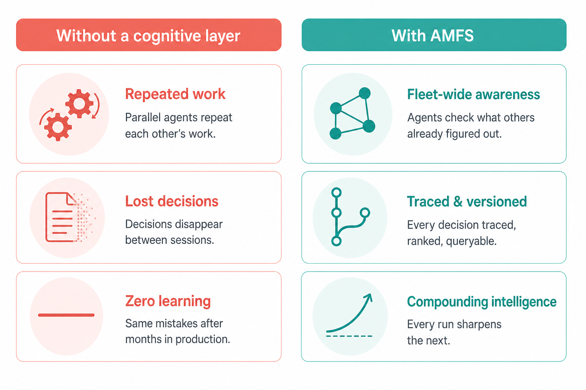
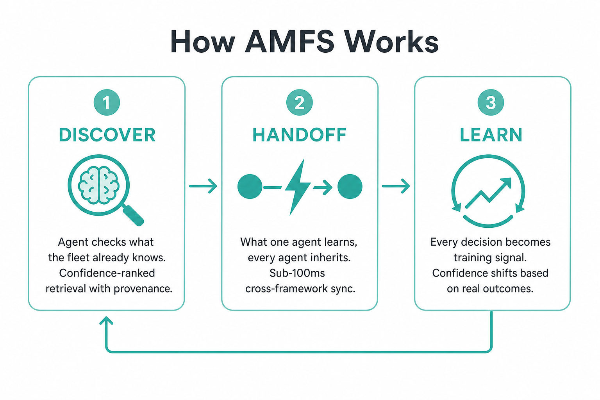
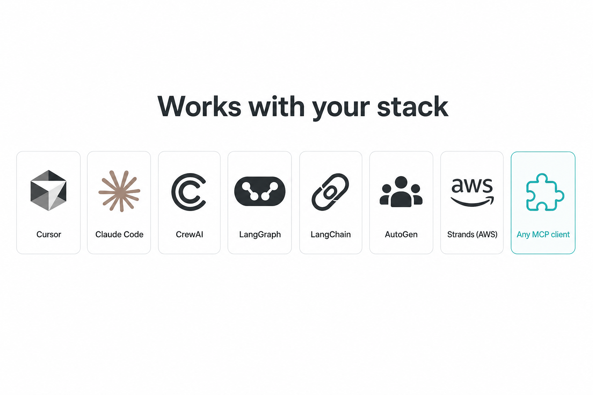

<p align="center">
  
</p>

<h1 align="center">AMFS — Agent Memory File System</h1>

<p align="center">
  <strong>The cognitive layer for multi-agent systems.<br/>Give your agents a shared brain.</strong>
</p>

<p align="center">
  <a href="https://github.com/raia-live/amfs/actions/workflows/test-python.yml"></a>
  <a href="https://github.com/raia-live/amfs/actions/workflows/test-typescript.yml"></a>
  <a href="LICENSE"></a>
  <a href="https://pypi.org/project/amfs/"></a>
  <a href="https://www.npmjs.com/package/@senselab-ai/amfs"></a>
</p>

<p align="center">
  <a href="https://www.sense-lab.ai">Website</a> · <a href="https://raia-live.github.io/amfs/">Docs</a> · <a href="https://raia-live.github.io/amfs/getting-started/quickstart/">Quick Start</a> · <a href="https://github.com/orgs/raia-live/projects/2">Roadmap</a> · <a href="https://raia-live.github.io/amfs/contributing/">Contributing</a>
</p>

---

## The Problem

Your agents talk to LLMs. Why don't they talk to each other?

You have orchestration. You have tools. What you don't have is a place where agents **validate each other's findings**, **build on shared context**, and **learn from what actually happened in production**.

<p align="center">
  
</p>

## How AMFS Works

AMFS connects your agents across frameworks, sessions, and machines. They share knowledge, coordinate, and learn as a team.

<p align="center">
  
</p>

**Discover** — Before acting, an agent queries AMFS for what the fleet already knows. Results come back ranked by confidence with full provenance — which agent wrote them, when, and how trustworthy they are.

**Handoff** — A finding written by one agent is readable by every other agent within milliseconds. The Cursor agent on your laptop and the LangGraph pipeline in production share the same memory.

**Learn** — When a deploy succeeds or an incident fires, AMFS records what the agent read, what it chose, and what happened. Confidence shifts based on real outcomes. Your training data writes itself.

## Quick Start

```bash
pip install amfs
```

```python
from amfs import AgentMemory, OutcomeType

mem = AgentMemory(agent_id="research-agent")

# Agent discovers a pattern and commits it to memory
mem.write("checkout-service", "retry-pattern",
          {"max_retries": 3, "strategy": "exponential-backoff"},
          confidence=0.85)

# Another agent reads it — the read is tracked automatically
entry = mem.read("checkout-service", "retry-pattern")

# Get a compiled briefing: everything the fleet knows about this entity
briefing = mem.briefing("checkout-service")

# When the deploy succeeds, confidence on related entries adjusts
mem.commit_outcome("DEP-287", OutcomeType.SUCCESS)

# Explain exactly which memories and contexts drove a decision
trace = mem.explain("DEP-287")
```

> **[Full quick start guide →](https://raia-live.github.io/amfs/getting-started/quickstart/)**

## Works With Your Stack

<p align="center">
  
</p>

Drop AMFS into whatever you're already using. No rewrites. Your agents start sharing what they know.

<details>
<summary><strong>MCP — Cursor, Claude Desktop, Claude Code</strong></summary>

One command to give any MCP-compatible client persistent agent memory.

macOS / Linux:

```bash
curl -sSL https://raw.githubusercontent.com/raia-live/amfs/main/install-mcp.sh | bash
```

Windows (PowerShell):

```powershell
irm https://raw.githubusercontent.com/raia-live/amfs/main/install-mcp.ps1 | iex
```

Or add manually to your MCP config:

```json
{
  "mcpServers": {
    "amfs": {
      "command": "python",
      "args": ["-m", "amfs_mcp_server"],
      "env": { "AMFS_API_KEY": "sk-your-key-here" }
    }
  }
}
```

> **[MCP setup guide →](https://raia-live.github.io/amfs/guides/mcp/)** · **[Cursor plugin →](https://github.com/raia-live/cursor-plugin)**

</details>

<details>
<summary><strong>Python SDK</strong></summary>

```bash
pip install amfs
```

```python
from amfs import AgentMemory

mem = AgentMemory(agent_id="my-agent")
mem.write("my-service", "finding", "mutex pattern applied", confidence=0.91)
briefing = mem.briefing("my-service")
```

</details>

<details>
<summary><strong>TypeScript SDK</strong></summary>

```bash
npm install @senselab-ai/amfs
```

```typescript
import { HttpAdapter } from '@senselab-ai/amfs';

const adapter = new HttpAdapter({ agentId: 'my-agent', apiKey: 'sk-...' });
await adapter.writeAsync('my-service', 'finding', 'mutex pattern applied', { confidence: 0.91 });
const briefing = await adapter.briefingAsync('my-service');
```

</details>

<details>
<summary><strong>Framework integrations — Strands, CrewAI, LangGraph, LangChain, AutoGen</strong></summary>

```bash
pip install amfs-strands       # AWS Strands Agents
pip install amfs-crewai        # CrewAI
pip install amfs-langgraph     # LangGraph
pip install amfs-langchain     # LangChain
pip install amfs-autogen       # AutoGen
```

> **[Integration guides →](https://raia-live.github.io/amfs/guides/)**

</details>

## Features

| | Feature | What it does |
|:--|:--------|:-------------|
| 🧠 | **Confidence & Outcomes** | Entries carry trust scores that shift when deploys succeed or incidents fire. |
| 🔍 | **Briefings** | One call returns everything the fleet knows about an entity — compiled, ranked, with provenance. |
| 📊 | **Hybrid Search** | Full-text + semantic + recency + confidence in a single ranked result set. |
| 🌳 | **Branching & PRs** | Create branches, diff changes, open pull requests, merge or discard — just like Git. |
| ⏪ | **Rollback & Tags** | Named snapshots. Restore to any tag or event. |
| 🔗 | **Knowledge Graph** | Relationships auto-materialize from normal operations. Query connections between entities. |
| 📖 | **Causal Explainability** | `explain()` shows exactly which memories and contexts drove a decision. |
| 🕐 | **Git-like Timeline** | Every write, outcome, and cross-agent read is logged. Full audit trail. |
| 🔒 | **Access Control** | Grant read or read/write per branch, user, team, or API key. Multi-tenant isolation. |
| 📦 | **Training Signal Output** | Export SFT/DPO datasets from real decision traces — not synthetic data. |
| 🔌 | **MCP Server** | First-class support for Cursor, Claude Desktop, Claude Code, and any MCP client. |
| 🧩 | **Connectors** | PagerDuty, GitHub, Slack, Jira — or [build your own](https://raia-live.github.io/amfs/guides/connectors/). |

## Architecture

AMFS is a monorepo with a layered architecture. Pick what you need:

| Package | Install | Description |
|:--------|:--------|:------------|
| **Python SDK** | `pip install amfs` | Core client library — `AgentMemory` class |
| **TypeScript SDK** | `npm install @senselab-ai/amfs` | TypeScript client with full async API |
| **MCP Server** | `pip install amfs-mcp-server` | Model Context Protocol server for Cursor / Claude |
| **HTTP Server** | `pip install amfs-http-server` | REST API server |
| **Core Engine** | `pip install amfs-core` | Storage engine, versioning, timeline |
| **CLI** | `pip install amfs-cli` | Command-line tools |

**Storage adapters** — plug in your backend:

| Adapter | Install |
|:--------|:--------|
| Filesystem (default) | `pip install amfs-adapter-filesystem` |
| PostgreSQL | `pip install amfs-adapter-postgres` |
| S3 | `pip install amfs-adapter-s3` |
| HTTP (remote) | `pip install amfs-adapter-http` |

**Integrations:**

```bash
pip install amfs-strands        # AWS Strands Agents
pip install amfs-crewai         # CrewAI
pip install amfs-langgraph      # LangGraph
pip install amfs-langchain      # LangChain
pip install amfs-autogen        # AutoGen
```

Or run with Docker:

```bash
docker run -p 8080:8080 -v amfs-data:/data ghcr.io/raia-live/amfs
```

## OSS vs Pro

AMFS is open source under [Apache 2.0](LICENSE). The OSS edition gives you the full memory engine — versioned writes, confidence scoring, outcome feedback, causal traces, knowledge graph, hybrid search, git-like timeline, SDKs, adapters, HTTP API, MCP server, and CLI.

**[AMFS Pro](https://www.sense-lab.ai)** adds: branching, merge, pull requests, access control, tags, rollback, cherry-pick, fork, multi-tenant isolation, immutable decision traces, the intelligence layer (Cortex), and a web dashboard.

> **OSS = single-branch repo with full history. Pro = GitHub.**

**[See plans & pricing →](https://www.sense-lab.ai)**

## Development

```bash
git clone https://github.com/raia-live/amfs.git && cd amfs
uv pip install -e packages/core -e packages/adapters/filesystem -e packages/sdk-python -e packages/cli -e packages/http-server
uv run pytest tests/ -v
```

> **[Contributing guide →](https://raia-live.github.io/amfs/contributing/)**

## Community

- [GitHub Discussions](https://github.com/raia-live/amfs/discussions) — questions, ideas, show & tell
- [Roadmap](https://github.com/orgs/raia-live/projects/2) — what's shipped and what's next
- [Issues](https://github.com/raia-live/amfs/issues) — bug reports and feature requests

## License

[Apache License 2.0](LICENSE) — free for commercial use, modification, and distribution.
