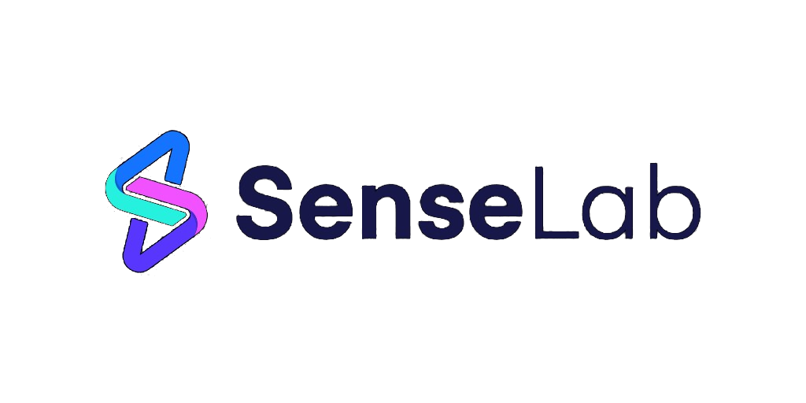
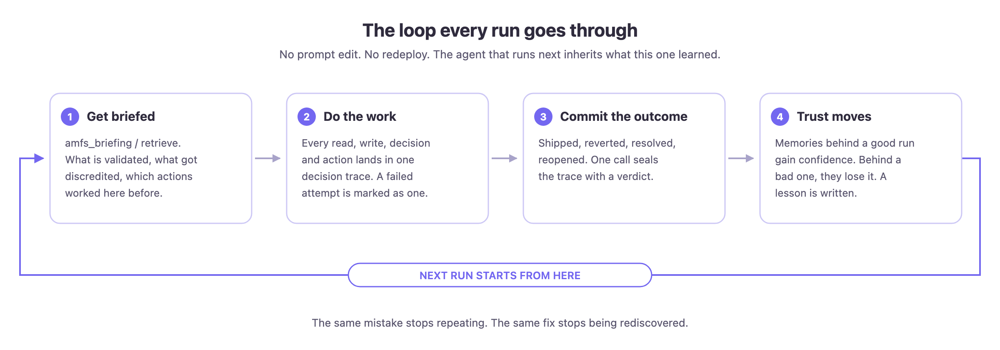
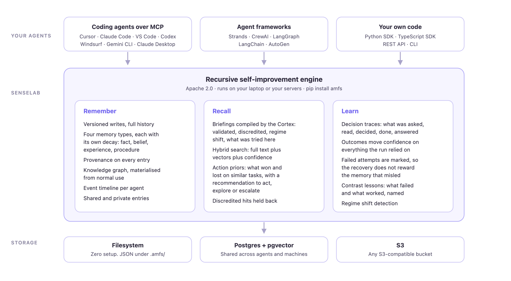

<p align="center">
  
</p>

<h3 align="center">The recursive self-improvement engine for AI agents</h3>

<p align="center">
  Your agent does the work. SenseLab remembers what happened, checks how it turned out,<br>
  and hands the next run a better starting point than the last one had.
</p>

<p align="center">
  <a href="https://github.com/raia-live/amfs/actions/workflows/test-python.yml"></a>
  <a href="https://github.com/raia-live/amfs/actions/workflows/test-typescript.yml"></a>
  <a href="https://pypi.org/project/amfs/"></a>
  <a href="https://www.npmjs.com/package/@senselab-ai/amfs"></a>
  <a href="LICENSE"></a>
</p>

<p align="center">
  <a href="https://sense-lab.ai">Website</a> ·
  <a href="https://raia-live.github.io/amfs/">Docs</a> ·
  <a href="#try-it">Try it</a> ·
  <a href="#what-the-agent-gets">What the agent gets</a> ·
  <a href="https://github.com/raia-live/amfs/issues">Issues</a>
</p>

## Why this exists

Every agent run starts from zero. The fix an agent found on Tuesday is gone by Wednesday. The approach that failed three times last week gets tried a fourth time. RAG gives an agent documents; it does not give the agent its own track record.

SenseLab is the missing track record. It stores what an agent knew, what it decided, what it did, and how that went. Then it uses the outcome to move confidence in every memory the run relied on, so the good ones rise and the bad ones sink out of the way. Run it enough times on the same kind of task and the agent stops repeating mistakes and stops rediscovering fixes.

This repo is the open source engine. It runs on a laptop with zero setup, or on your own Postgres for a team of agents. No account needed.

> Naming note: the project started life as AMFS (Agent Memory File System), and the package names on PyPI and npm still carry that. `pip install amfs` gets you SenseLab.

## The loop

<p align="center">
  
</p>

1. Before work, the agent asks for a briefing. It gets back what is validated, what has been discredited, what changed recently, and which actions worked here before.
2. During work, reads, decisions, and actions are tracked in a decision trace. If a remembered fix does not pan out, the agent marks the attempt before moving on.
3. When it is done, the agent commits the outcome: success, or some flavour of failure.
4. Confidence moves. Memories the run leaned on get reinforced or demoted. A failed attempt demotes only what misled it, and the recovery does not reward the memory that sent the agent down the wrong path. A contrast lesson gets written naming what failed and what worked.

The next run starts from step 1 with a better briefing. That is the whole trick.

## Try it

### With a coding agent (Cursor, Claude Code, VS Code, Codex, Windsurf, Gemini CLI, Claude Desktop)

```bash
curl -sSL https://raw.githubusercontent.com/raia-live/amfs/main/install-mcp.sh | bash
```

That detects which clients you have installed and adds a `senselab` MCP server to each one. No flags means local mode: the server runs on your machine and keeps its data in a `.amfs/` folder. Restart your editor and the agent has 40 memory tools, starting with `amfs_briefing`, `amfs_retrieve`, `amfs_write`, and `amfs_commit_outcome`.

Want to pick a client, or point it at a shared server?

```bash
# only one client
curl -sSL https://raw.githubusercontent.com/raia-live/amfs/main/install-mcp.sh | bash -s -- --client cursor

# remove it again
curl -sSL https://raw.githubusercontent.com/raia-live/amfs/main/install-mcp.sh | bash -s -- --uninstall
```

To use your own self-hosted server (see below), add `AMFS_HTTP_URL` to the `senselab` entry the installer wrote:

```json
{
  "senselab": {
    "command": "uvx",
    "args": ["--refresh", "amfs-mcp-server"],
    "env": { "AMFS_HTTP_URL": "http://localhost:8080" }
  }
}
```

Drop the agent instructions from [`CLAUDE.md`](CLAUDE.md) into your project so the agent knows when to brief, write, and commit. The [MCP guide](docs/guides/mcp.md) has manual setup for every client.

### From Python

```bash
pip install amfs
```

```python
from amfs import AgentMemory

mem = AgentMemory(agent_id="deploy-agent")

# 1. Get briefed. Ranked, evidence-tagged context for the thing you are about to touch.
for digest in mem.briefing(entity_path="acme/checkout"):
    print(digest.summary.get("narrative"))

# 2. Recall specifics by meaning. No key, no exact path.
hits = mem.retrieve("why does the checkout worker restart loop", entity_path="acme/checkout")

# ... do the work, recording what you did ...
mem.record_action("deploy_rollback", {"service": "checkout", "to_version": "v41"})

# A remembered fix did not work? Say so before trying the next thing.
mem.record_attempt(summary="restarted worker per runbook; queue still stuck")

# 3. Write what a future agent would need.
mem.write("acme/checkout", "risk-worker-restart-loop",
          "Worker restarts loop when the Redis URL has no db index; add /0.",
          memory_type="belief", confidence=0.8)

# 4. Commit the outcome. This is where learning happens.
mem.commit_outcome("INC-2291", "success",
                   task_input="checkout worker restart looping in prod",
                   response_text="Added the db index to REDIS_URL, worker stable for 30 min.")
```

That works against the filesystem adapter with nothing else running. The full loop, with compiled briefings and action priors, wants the server and Postgres behind it.

### Self-hosted server

```bash
git clone https://github.com/raia-live/amfs.git && cd amfs
docker compose up
```

That starts the HTTP server on `:8080` with Postgres and pgvector behind it, plus the Cortex worker that compiles briefings. Point the MCP server or the SDK at it with `AMFS_HTTP_URL=http://localhost:8080`. The [Docker guide](docs/guides/docker.md) covers volumes, S3, Kubernetes, and API keys.

## What the agent gets

<p align="center">
  
</p>

Everything below is in this repo and works without an account.

### Memory that knows how sure it is

- Four memory types with their own decay curves: `fact`, `belief`, `experience`, `procedure`. A belief fades unless something confirms it; an experience sticks around.
- Confidence decays on four signals: time since written, memory type, outcomes it was part of, and how often it gets read. A memory nobody uses fades; one that keeps paying off does not.
- Every entry carries an evidence status: `untested`, `validated`, `contested`, or `discredited`. An untested 0.9 and a validated 0.9 are different things to act on, and the agent can tell them apart.
- Full version history on every key. Writes never overwrite; they add a version.

### Recall that comes with a recommendation

- `briefing()` returns compiled digests with `validated`, `discredited`, and `regime_shift` sections, plus `tried_here`: which actions were taken on this entity and how each fared.
- `retrieve()` is hybrid search: full text plus vectors plus confidence, with discredited hits held back. Pass `candidate_actions` and you also get action priors and a recommendation: `act` (take the suggested action), `explore` (everything tried here failed; try this untried one), or `escalate` (every candidate has been tried and failed, so skip the three doomed attempts).
- Regime shift detection. When a long-validated memory suddenly starts failing, the briefing flags it instead of letting the agent keep trusting it.

### Learning that is honest about failure

- Decision traces capture what the agent was asked, what it read, what it decided, what it did, and what it answered. Committed once, at the end.
- `record_attempt()` draws a line inside the trace. What was read before the line gets the failure; what was read after gets the success. Without that line, a stale memory that misled the agent would get credit for the recovery.
- Contrast lessons are written automatically: "X failed here, Y worked". They are the highest-value memories in the store and nobody has to author them.
- Outcomes can carry `verified_by` (`ci`, `human`, `customer`), so an agent declaring its own success is weighed differently from CI confirming it.

### The boring parts, handled

- Storage adapters for the filesystem (JSON, zero setup), Postgres with pgvector, and S3-compatible buckets. Swap by changing one env var.
- Knowledge graph and per-agent event timeline, built from normal reads and writes.
- Atomic commits with a DAG, `diff`, `verify`, and `merge_base` for tooling that wants to reason about memory over time.
- Agent identity that survives restarts, so work on the dashboard is attributed to the same `dashboard-agent` next week.
- An MCP server with 40 tools, an HTTP server with a REST API, a CLI, and a Docker image at `ghcr.io/raia-live/amfs`.

## Packages

| Package | What it is |
|---|---|
| [`amfs`](packages/sdk-python) | Python SDK. `AgentMemory` and everything above. |
| [`amfs-mcp-server`](packages/mcp-server) | MCP server for coding agents and desktop clients. stdio by default, `--transport http` too. |
| [`amfs-http-server`](packages/http-server) | FastAPI server with the REST API, auth, and the Cortex worker. |
| [`amfs-cortex`](packages/cortex) | Digest compiler and briefing service. Needs Postgres. |
| [`amfs-core`](packages/core) | The model: entries, confidence, evidence, traces, actions. |
| [`amfs-cli`](packages/cli) | `amfs` on the command line. |
| [`amfs-adapter-postgres`](packages/adapters/postgres), [`-filesystem`](packages/adapters/filesystem), [`-s3`](packages/adapters/s3), [`-http`](packages/adapters/http) | Storage backends. |
| [`@senselab-ai/amfs`](packages/sdk-typescript) | TypeScript SDK for Node and browsers. |
| [`amfs-integrations-strands`](packages/integrations/strands), [`-crewai`](packages/integrations/crewai), [`-langgraph`](packages/integrations/langgraph), [`-langchain`](packages/integrations/langchain), [`-autogen`](packages/integrations/autogen) | Framework hooks. See [Strands](docs/guides/strands.md) and [CrewAI](docs/guides/crewai.md). |

## Open source and SenseLab Cloud

The engine in this repo is the same one behind [SenseLab Cloud](https://sense-lab.ai). Everything on this page runs on your own hardware under Apache 2.0.

Cloud adds the things that only make sense with a hosted service: a dashboard to watch agents learn, shared rooms where several people's agents collaborate on the same memory, multi-tenant access control, branch and merge for memory, and training data export for fine-tuning models on your agents' decision traces. If you want that, the same installer takes an `--api-key`. If you do not, nothing here nags you about it.

Full breakdown in [docs/editions.md](docs/editions.md).

## Development

```bash
git clone https://github.com/raia-live/amfs.git && cd amfs
uv pip install -e packages/core -e packages/adapters/filesystem -e packages/adapters/postgres \
  -e packages/sdk-python -e packages/cli -e packages/mcp-server -e packages/cortex -e packages/http-server
uv run pytest tests/ -v
```

Python 3.11 or newer. The TypeScript SDK lives in `packages/sdk-typescript` and has its own `npm test`. Docs are Markdown under [`docs/`](docs/) and publish to [raia-live.github.io/amfs](https://raia-live.github.io/amfs/). Contributions welcome; open an issue first if the change is big, otherwise send the PR.

## Community

- [Issues](https://github.com/raia-live/amfs/issues) for bugs, questions, and ideas
- [Roadmap](https://github.com/orgs/raia-live/projects/2) for what is coming
- [Website](https://sense-lab.ai) for the hosted product

If SenseLab saves your agent from repeating itself, a star helps other people find it.

## License

Python packages and the servers are [Apache 2.0](LICENSE). The TypeScript SDK (`@senselab-ai/amfs`) is under the Business Source License 1.1; see its [package](packages/sdk-typescript) for terms.
